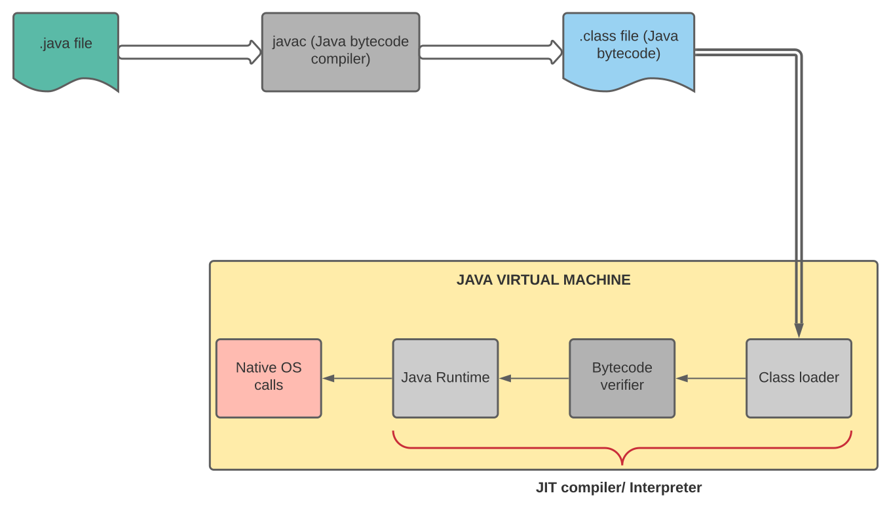

# **Java Performance Notes**
Java versions covered: 8, 11 and eventually 17.

## **Index**

## **JVM and the Bytecode**

### Bytecode

The Java bytecode is the instruction set that Java Virtual Machine can interpret, as assembler in
bare metal machines can be executed, the JVM executes this bytecode, to do this JVM use two 
different mechanisms:

    - The Interpreter
    - The Just-In-Time Compiler

### JIT Compiler vs Interpreter

When we compile our Java program (e.g., using the javac command), we'll end up with our source code compiled into the binary representation 
of our code (JVM bytecode).

To be able to run a Java program, **the JVM interprets the bytecode**. Since interpreters are
usually a lot slower than native code executing on a real processor, the **JVM can run another
compiler which will now compile our bytecode into the machine code that can be run by the
processor**, this so-called just-in-time compiler.

The _de-facto_ standard for executing Java Bytecode has been Interpreting, but in recent years
the JIT Compilation has been gaining popularity because improves the performance of the applications
in most cases.

#### Interpreter
An Interpreter normally reads the code line by line and translates the code to machine code 
as it reads the lines.

#### JIT Compiler
The Just-In-Time compiler is similar to the Interpreter in most cases, but has a significant 
difference: the JIT Compiler would compile the **most used code** to **native machine code**, for
the rest is similar because it reads line by line the code. To know what code to compile it saves 
a count variable for every method that is actualized with every call, so the compiler is triggered 
in some point to compile the method to native machine code to avoid re-interpreting that code again.

The process of JIT  compiling is performed in a **separated thread** in the JVM (the JVM it's by 
itself a multi-thread application) so the normal execution it's not interrupted by the JIT compiler.

### The C1 and C2 Compilers

