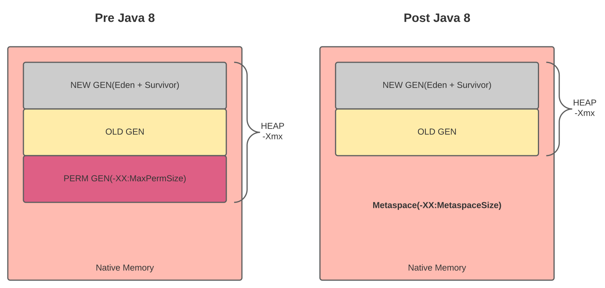

# **`Java Performance Notes`**
Java versions covered: 8, 11 and eventually 17.

# Table of contents

- [**Introduction**](#introduction)
    - [**JVM and the Bytecode**](#jvm-and-the-bytecode)
        - [Bytecode](#bytecode)
        - [JIT Compiler vs Interpreter](#jit-compiler-vs-interpreter)
            - [Interpreter](#interpreter)
            - [JIT Compiler](#jit-compiler)
        - [The C1 and C2 Compilers](#the-c1-and-c2-compilers)
        - [Code cache](#code-cache)
    - [**Memory allocations: Heap vs Stack**](#memory-allocations-heap-vs-stack)
        - [The stack](#the-stack)
        - [The heap](#the-heap)
    - [**Passing objects methods**](#passing-objects-methods)
        - [Passing variables vs passing references](#passing-variables-vs-passing-references)
- [**Performance Testing**](#performance-testing)
    - [**Microbenchmarks**](#microbenchmarks)
    - [**Macrobenchmarks**](#macrobenchmarks)
    - [**Mesobenchmarks**](#mesobenchmarks)
    - [**Benchmarking with JMH**](#benchmarking-with-jmh)
    - [**Throughput, Batching, and Response Time**](#throughput-batching-and-response-time)
    - [**Understand Variability**](#understand-variability)
    - [**Test Early, Test Often**](#test-early-test-often)
- [**A Java Performance Toolbox**](#a-java-performance-toolbox)
    - [**Operating System Tools and Analysis**](#operating-system-tools-and-analysis)
    - [**Java Monitoring Tools**](#java-monitoring-tools)
    - [**Profiling Tools**](#profiling-tools)
    - [**Java Flight Recorder**](#java-flight-recorder)
- [**JVM and Compilers**](#jvm-and-compilers)
    - [**Just-in-Time Compilers: An Overview**](#just-in-time-compilers-an-overview)
    - [**Tiered Compilation**](#tiered-compilation)
    - [**Common Compiler Flags**](#common-compiler-flags)
    - [**Advanced Compiler Flags**](#advanced-compiler-flags)
    - [**GraalVM**](#graalvm)
    - [**Selecting the JVM**](#selecting-the-jvm)
        - [32 vs 64 bit JVM](#32-vs-64-bit-jvm)
        - [Tiered Compilation](#tiered-compilation)
        - [Tuning the native compiler](#tuning-the-native-compiler)
    - [**The Metaspace and internal JVM memory optimisation**](#the-metaspace-and-internal-jvm-memory-optimisation)
        - [PermGen vs Metaspace](#permgen-vs-metaspace)
            - [PermGen](#permgen)
            - [Metaspace](#metaspace)
    - [**Tuning the JVM Memory Settings**](#tuning-the-jvm-memory-settings)
        - [String pool](#string-pool)
            - [Tuning the size of the string pool](#tuning-the-size-of-the-string-pool)
            - [Tuning the size of the heap](#tuning-the-size-of-the-heap)
- [**Garbage collection**](#garbage-collection)
    - [**Garbage Collection Overview**](#garbage-collection-overview)
        - [The _gc()_ method](#the-_gc_-method)
        - [The _finalize()_ method](#the-_finalize_-method)
        - [Generational Garbage Collection](#generational-garbage-collection)
        - [Garbage collection tuning and selection](#garbage-collection-tuning-and-selection)
            - [Basic GC tuning](#basic-gc-tuning)
            - [Choosing garbage collector](#choosing-garbage-collector)
        - [GC Tools](#gc-tools)
    - [**Garbage Collection algorithms**](#garbage-collection-algorithms)
        - [Throughput Collector](#throughput-collector)
        - [G1 Garbage Collector](#g1-garbage-collector)
        - [CMS Collector](#cms-collector)
        - [Advanced Tunings](#advanced-tunings)
        - [Experimental GC Algorithms](#experimental-gc-algorithms)
- [**Heap Memory Best Practices**](#heap-memory-best-practices)
    - [**Heap Analysis**](#heap-analysis)
        - [Monitoring the Heap](#monitoring-the-heap)
        - [Analysing a heap dump](#analysing-a-heap-dump)
            - [Generating a heap dump](#generating-a-heap-dump)
    - [**Using Less Memory**](#using-less-memory)
    - [**Object Life-Cycle Management**](#object-life-cycle-management)
- [**Native Memory Best Practices**](#native-memory-best-practices)
    - [**Footprint**](#footprint)
    - [**JVM Tunings for the Operating System**](#jvm-tunings-for-the-operating-system)
- [**Threading and Synchronization Performance**](#threading-and-synchronization-performance)
    - [**Thread Pools and ThreadPoolExecutors**](#thread-pools-and-threadpoolexecutors)
    - [**The ForkJoinPool**](#the-forkjoinpool)
    - [**Thread Synchronization**](#thread-synchronization)
    - [**JVM Thread Tunings**](#jvm-thread-tunings)
    - [**Monitoring Threads and Locks**](#monitoring-threads-and-locks)
- [**Java Servers**](#java-servers)
    - [**Server Containers**](#server-containers)
    - [**Asynchronous Outbound Calls**](#asynchronous-outbound-calls)
- [**Database Performance Best Practices**](#database-performance-best-practices)
    - [**JDBC**](#jdbc)
    - [**JPA**](#jpa)
- [**Java SE API Tips**](#java-se-api-tips)
    - [**Strings**](#strings)
    - [**Buffered I/O**](#buffered-io)
    - [**Classloading**](#classloading)
    - [**Random Numbers**](#random-numbers)
    - [**Java Native Interface**](#java-native-interface)
    - [**Exceptions**](#exceptions)
    - [**Logging**](#logging)
    - [**Java Collections API**](#java-collections-api)
    - [**Lambdas and Anonymous Classes**](#lambdas-and-anonymous-classes)
    - [**Stream and Filter Performance**](#stream-and-filter-performance)
    - [**Object Serialization**](#object-serialization)
- [**Summary of Tuning Flags**](#summary-of-tuning-flags)
- [**References/Bibliography**](#referencesbibliography)

# **Introduction**

## **JVM and the Bytecode**

### Bytecode

The Java bytecode is the instruction set that Java Virtual Machine can interpret, as assembler in
bare metal machines can be executed, the JVM executes this bytecode, to do this JVM use two 
different mechanisms:

    - The Interpreter
    - The Just-In-Time Compiler

### JIT Compiler vs Interpreter

When we compile our Java program (e.g., using the javac command), we'll end up with our source code compiled into the binary representation 
of our code (JVM bytecode).

To be able to run a Java program, **the JVM interprets the bytecode**. Since interpreters are
usually a lot slower than native code executing on a real processor, the **JVM can run another
compiler which will now compile our bytecode into the machine code that can be run by the
processor**, this so-called just-in-time compiler.

The _de-facto_ standard for executing Java Bytecode has been Interpreting, but in recent years
the JIT Compilation has been gaining popularity because improves the performance of the applications
in most cases.

#### Interpreter
An Interpreter normally reads the code line by line and translates the code to machine code 
as it reads the lines.

#### JIT Compiler
The Just-In-Time compiler is similar to the Interpreter in most cases, but has a significant 
difference: the JIT Compiler would compile the **most used code** to **native machine code**, for
the rest is similar because it reads line by line the code. To know what code to compile it saves 
a count variable for every method that is actualized with every call, so the compiler is triggered 
in some point to compile the method to native machine code to avoid re-interpreting that code again.

The process of JIT  compiling is performed in a **separated thread** in the JVM (the JVM it's by 
itself a multi-thread application) so the normal execution it's not interrupted by the JIT compiler.

**EXAMPLE**

The code for this example is in [Performance_Example_1](examples/Java11/PerformanceExample1) :

> In order to see which methods are being compiled by the JIT compiler we use the
> flag:
> 
> _-XX:+PrintCompilation_ 

When you compile this code you can see something like this:

`156   60   %    4       java.lang.String::hashCode (49 bytes)   made not entrant`

this means that your code has been compiled to the most optimal compilation level (level 4)

### The C1 and C2 Compilers

The JDK implementation contains two conventional JIT-compilers: the client compiler, also 
called C1 and the server compiler, called opto or C2.

**C1 is designed to run faster and produce less optimized code**, **while C2, on the other hand,
takes a little more time to run but produces a better-optimized code**. The client compiler is
a better fit for desktop applications since we don't want to have long pauses for the 
JIT-compilation. The server compiler is better for long-running server applications that can
spend more time on the compilation.

The JVM would decide which compile level would be applied to your code from 1 to 4 level 
(4 is the most optimized level).

We can see when the C2 compiler is used in the code as the method is called if we use the
flags:

    -XX:+UnlockDiagnosticVMOptions
    -XX:+LongCompilation

### Code cache

The compiled code from the JIT compiler is going to be allocated in the code cache, as a cache
the reason for using it is to improve the performance of the I/O operations 
(is faster than main memory), but has a little problem, the amount of cache memory is very 
limited, so we can only optimize a little fraction of our code.

If you have too much code for optimization you will see a message like this:

`VM warning: CodeCache is full. Compiler has been disabled. `

meaning that even though there are code to be optimized, the compiler won't optimize such code
because cannot use the code cache (is already full).

We can see the code cache size and other basic information if we use the flag:

    -XX:+PrintCodeCache

We specify the initial, maximum and growing rate for the code cache with the flags:

    -XX:InitialCodeCacheSize=[size]

    -XX:ReservedCodeCacheSize=[size]

    -XX:CodeCacheExpansionSize=[size]

the size can be provided in Kilobytes (k) or Megabytes(m or M)

**We can use JConsole to monitor the code cache in a remote way, just connect the process
you want to monitor and select memory menu.**

## **Memory allocations: Heap vs Stack**

Our starting point is to understand the terms of the stack and the heap when our applications
run they need access to some of our computers' memory, for example, to store the objects
that we create and hold a memory.

### The stack

The stack is a very efficient data structure, which is managed effectively by the Java virtual
machine.

One important aspect of the stack is that Java knows exactly when data on the stack can be
destroyed (garbage collection).

In Java **all local variables are created on the stack**, and they are automatically popped from
the stack when you reach the close of the block that created that variable. All this happens
within the Java Virtual Machine.

### The heap

The second area of Java's memory is called the heap. Although the stack is a very efficient
data structure, it can't be used to store complex data types such as an **object**.

## **Passing objects methods**

### Passing variables vs passing references

All object references in Java are passed by value. This means that a copy of the value will
be passed to a method. But the trick is that passing a copy of the value also changes the real
value of the object.

For objects passed to methods, the **Reference** to the object is passed by **Value**

**_final_ keyword**

Real meaning of the final keyword is not that the variable can never be changed, but 
that the variable can only be assigned once. Once the variable has been assigned, it can never 
be altered.

The _final_ keyword **doesn't stop** the object value from changing, only prevents the stack pointer
from changing to the actual object.

# **Performance Testing**

## **Microbenchmarks**

## **Macrobenchmarks**

## **Mesobenchmarks**

## **Benchmarking with JMH**

## **Throughput, Batching, and Response Time**

## **Understand Variability**

## **Test Early, Test Often**

# **A Java Performance Toolbox**

## **Operating System Tools and Analysis**

## **Java Monitoring Tools**

## **Profiling Tools**

## **Java Flight Recorder**

# **JVM and Compilers**

## **Just-in-Time Compilers: An Overview**

## **Tiered Compilation**

## **Common Compiler Flags**

## **Advanced Compiler Flags**

## **GraalVM**

## **Selecting the JVM**

### 32 vs 64 bit JVM
Here are some key difference between 32-bit and 64-bit Java Virtual Machine

1. 64-bit JVM, you can specify more memory for heap size than 32-bit JVM, like in
   32-bit JVM, the theoretical limit for maximum memory in 32-bit is 4G, but 64-bit is
   much higher.

2. 64-bit JVM is particularly useful for Java applications with large heaps, like
   applications that use more than 100G for max memory.

3. The same Java application will take memory while running in 64-bit JVM then 32-bit
   because of the increased size of OOP (Ordinary Object pointer), from 32 to 64 bits. Though
   you can get away with this by using -XXCompressedOOP JVM option, which tells JVM to use
   32-bit pointers.

4. Both 32-bit and 64-bit JVM have a separate installer.

5. One more thing that changed in the 64 bit JVM architecture is object header size; it is
   now 12 bytes in comparison to 8 bytes headers in 32 bit JVM. Another thing that changed is
   the size of internal references that means it can go a maximum of up to 8 bytes wherein 32
   bit JVM up-to 4 bytes.

So, from these two points, you can conclude that an application running on 64 bit JVM will
consume more space in comparison when the same application runs on the 32-bit version.

In order to force the JIT compiler to use only a type of compiler we can use the flags:

    -client for client compiler(C1)
    
    -server for server compiler(C2)

    -d64 for the 64 bit compiler version

### Tiered Compilation

As we mentioned in the previous section, our Java program, compiled by **javac**, starts its
execution in an interpreted mode. The JVM tracks each frequently called method and compiles
them. In order to do that, it uses C1 for the compilation. But, the HotSpot still keeps an
eye on the future calls of those methods. If the number of calls increases, the JVM will
recompile these methods once more, but this time using C2.

This is the default strategy used by the HotSpot, called **tiered compilation**.

We can force the JVM to run in interpreter-mode only with the flag:

    -XX:-TieredCompilation (we turn off the flag)

### Tuning the native compiler
We can specify the number of threads to perform a compilation with the flag:

    -XX:-CICompilerSize=[size] (default 3, minimum 2)

We also can specify the  threshold number for the C2 compiler to be triggered:

    -XX:CompileThreshold=[threshold_value]

## **The Metaspace and internal JVM memory optimisation**

In general, the heap is absolutely huge compared to the stacks and the metaspace, which are
quite small. So the metaspace is used primarily to store metadata. That's going to be 
information about classes, methods, which methods, for example, have been compiled into 
bytecode and which should be compiled native code in general.

But there are other uses for the better space which are more interesting. 

And **the first** of these is it's where **static variables are stored**. We can think of the metaspace
as having the same role as a stack for any object or any variable that we declare as a static
variable so static primitives are stored entirely in the metaspace and **static objects
are stored on the heap**, but with the object pointer or **reference held in the metaspace**.

So if, for example, we declared a _static int_, that's a primitive core global variable that
would exist solely in the meta space if we created a static object in this case, it would be
a _hashmap_. That map would be created on the heap, but with the variable reference in this
case called settings in the metaspace.

Unlike a stack where variables can be popped off when they go out of scope, variables in the 
matter space are permanently there, as we would expect for static variables. They never reach
a state where they can no longer be referenced. **So any objects on the heap which are referenced
from the metaspace will never be garbage collected**.

**All classes and all threads within a Java program have access to the metaspace**, and that's 
why static variables can be accessed by any piece of code we write in our application, because 
the thread running that code can access the letter space, so it can access any variables that
are declared to be living in the metaspace.

### PermGen vs Metaspace

#### PermGen

PermGen (Permanent Generation) is a special heap space separated from the main memory heap.

The JVM keeps track of loaded class metadata in the PermGen. Additionally, the JVM stores all
the static content in this memory section. This includes all the static methods, primitive 
variables, and references to the static objects.

Furthermore, it contains data about bytecode, names, and JIT information. Before Java 7, the
_String Pool_ was also part of this memory. 

The default maximum memory size for 32-bit JVM is 64 MB and 82 MB for the 64-bit version.

However, we can change the default size with the JVM options:

    -XX:PermSize=[size] is the initial or minimum size of the PermGen space

    -XX:MaxPermSize=[size] is the maximum size

Most importantly, **Oracle completely removed this memory space in the JDK 8 release**.
Therefore, if we use these tuning flags in Java 8 and newer versions, we'll get the following
warnings:

`>> java -XX:PermSize=100m -XX:MaxPermSize=200m -version
OpenJDK 64-Bit Server VM warning: Ignoring option PermSize; support was removed in 8.0
OpenJDK 64-Bit Server VM warning: Ignoring option MaxPermSize; support was removed in 8.0
...`

With its limited memory size, PermGen is involved in generating the famous _OutOfMemoryError_. 
Simply put, the class loaders weren't garbage collected properly and, as a result, generated
a memory leak.

Therefore, we receive a memory space error; this happens mostly in the development environment
while creating new class loaders.

#### Metaspace

Simply put, Metaspace is a new memory space (starting from the Java 8 version); **it has replaced
the older PermGen memory space**. The most significant difference is how it handles memory 
allocation.

Specifically, **this native memory region grows automatically by default**.

We also have new flags to tune the memory:

* MetaspaceSize and MaxMetaspaceSize: we can set the Metaspace upper bounds.
* MinMetaspaceFreeRatio: is the minimum percentage of class metadata capacity free after
garbage collection
* MaxMetaspaceFreeRatio: is the maximum percentage of class metadata capacity free after a
garbage collection to avoid a reduction in the amount of space

Additionally, the garbage collection process also gains some benefits from this change. The
garbage collector now automatically triggers the cleaning of the dead classes once the class
metadata usage reaches its maximum metaspace size.

Therefore, **with this improvement, JVM reduces the chance to get the OutOfMemory error**.

**Despite all of these improvements, we still need to monitor and tune the metaspace to avoid 
memory leaks.**

## **Tuning the JVM Memory Settings**

### String pool

Java internally implements the **flyweight pattern** and generates a pool of Strings that is 
shared. In this way, every time we need to create a new Java chain, it checks if it already 
exists in the pool, in which case it returns a reference to it.

If our string pool is so full, it would be so condensed, it's going to be pretty inefficient.
Being aware of the density of your string pool, particularly for very big applications, is
definitely something to be aware of and to monitor, because if it is getting to be quite
dense, that could be something which is going to be slowing down your application.

The following flag will give us information about strings in our application:

    -XX:+PrintStringTableStatistics

this flag tells us how many buckets there are in the pool and how dense our pool is.

#### Tuning the size of the string pool

Remember, this doesn't get resized unlike a regular hashmap. So whatever number we start
with is going to be the number for the length of our application.

The flag for specifying the string pool size is, this flag specifies the **number of buckets**:
    
    -XX:StringTableSzie=[size]

**For this to work in an optimal way, the number that you provide in here should be a 
prime number.**

#### Tuning the size of the heap

The flag for specifying the maximum heap size is:

    -XX:MaxHeapSize=[size]
    -Xmx[size] as the shortcut form

If we want to specify the initial heap size we can use:

    -XX:InitialHeapSize=[size]
    -Xms[size] as the shortcut form

If we want to know the default values of these parameters we can use the flags combined:

    -XX:+UnlockDiagnosticVMOptions
    -XX:+PrintFlagsFinal

# **Garbage collection**

## **Garbage Collection Overview**

One of the big differences between Java and some other programming languages that you might
have used, such as C are that when you finished using an object in Java, you don't have to tell 
Java that it's no longer needed.

The virtual machine works this out automatically in languages like C or C++. Plus the exact 
opposite of this is the case for any object on the heap in these languages. The programmer must 
include code that tells the language that you finished with this object in C, you do this by
calling a function called free in visual basic.

**The way Java knows wich object it's no longer needed it's when an object cannot be reached 
through a reference from the stack.**

### The _gc()_ method

There are some methods in the Java API that seem to have a bearing on the garbage collector. In
particular, there's a method of the system class called GC. If you see the Java docs for the 
method you'll see it says that the method **suggests** that the Java virtual machine runs 
the garbage collection process, so it's going to tell the virtual machine to run a garbage 
collection process **but there's no guarantee** that the virtual machine will actually do that.

### The _finalize()_ method

When an object is garbage collected Java will run the _finalize()_ method, the method is available 
for use in all Java version but is deprecated since Java 9.

### Generational Garbage Collection

//TODO

### Garbage collection tuning and selection

#### Basic GC tuning

There are a number of different garbage collection algorithms that Java can use, and these are 
known as garbage collectors. The Java virtual machine decides which is the best based on your 
hardware, and we'll see how to find out **which type of garbage collector** your computer is using.

    -verbose:gc

JVM by default can resize the heap for making less garbage collections. 
There is a runtime flag that will **turn off the dynamic resizing** of the heap.

    -XX:-UseAdaptiveSizePolicy 

Lots of objects are going to live for a short while and then will find themselves without 
references on the stack anymore or whether they're eligible for garbage collection. This is
this special scenario I wanted to set up because it doesn't match the default Java assumption.
So our objects are surviving for a short while rather than most objects not surviving any time 
at all.

Now, this is not necessarily the most realistic scenario, but it means that when we start
shooting the garbage collection for how the objects in our application behave, we should see
some real impacts. So one thing we'll certainly want to do is **minimize the number of
full garbage collections**.

One way of trying to achieve that is by using **three different runtime tuning flags**. 

Firstly, we can resize the different parts of the heap. We could say we want to
allocate more of our overall memory to the young generation and less of our memory to the
old generation. Doing that will mean that the garbage collections on the young generation 
will happen less frequently, meaning that movable objects will be garbage collected 
earlier so fewer of them will make it through to the old generation.

And we can also alter the thresholds for how many generations of garbage collection an object 
needs to survive before it gets moved to the old generation.

We can use the following flag to specify how many times bigger should the old generation be
compared to the young generation:

    -XX:NewRatio=n

The second flag means how much of the young generation should be taken up by the survivors
spaces zero and one, the rest of this will be the Eden space.

    -XX:SurvivorRatio=n

Third flag specifies is how many generations to an object survive before it becomes part of 
the old generation. **15/16 is the maximum value for this flag**.

    -XX:MaxTenuringThreshold=n

#### Choosing garbage collector

There are three types of garbage collector we can use in our applications:

* Serial

    `-XX=+UseSerialGC`

* Parallel

  `-XX=+UseParallelGC`

* Mostly concurrent

  `-XX=+UseConcMarkSweepGC`

  `-XX=+UseG1GC`

### GC Tools

//TODO

## **Garbage Collection algorithms**

### Throughput Collector

### G1 Garbage Collector

### CMS Collector

### Advanced Tunings

### Experimental GC Algorithms

# **Heap Memory Best Practices**

## **Heap Analysis**

### Monitoring the Heap

**(J)VisualVM**  is actually an Oracle project, although Oracle have released it under the 
new version to license with classpath exception. So it is absolutely free for you to 
download and use.

You might notice if you read the download page that actually what you're downloading 
is the Oracle JDK 8 version of Java official VM. That's because from version 9 
onwards they've moved this into something called the **GraalVisualVM**.

**With these tools we can monitor our application memory and identify memory issues.**

### Analysing a heap dump

//TODO

#### Generating a heap dump

In order to generate a heap dump from the JVM we use:

    -XX:+HeapDumpOnOutOfMemoryError
    -XX:HeapDumpPath=[path]

If we want to analyze the heap dump file we need to use a memory analyzer, IntelliJ and Eclipse
has tools to do this.

## **Using Less Memory**

## **Object Life-Cycle Management**

# **Native Memory Best Practices**

## **Footprint**
## **JVM Tunings for the Operating System**

# **Threading and Synchronization Performance**

## **Thread Pools and ThreadPoolExecutors**
## **The ForkJoinPool**
## **Thread Synchronization**
## **JVM Thread Tunings**
## **Monitoring Threads and Locks**

# **Java Servers**

## **Server Containers**
## **Asynchronous Outbound Calls**

# **Database Performance Best Practices**

## **JDBC**
## **JPA**

# **Java SE API Tips**

## **Strings**
## **Buffered I/O**
## **Classloading**
## **Random Numbers**
## **Java Native Interface**
## **Exceptions**
## **Logging**
## **Java Collections API**
## **Lambdas and Anonymous Classes**
## **Stream and Filter Performance**
## **Object Serialization**

# **Summary of Tuning Flags**

# **References/Bibliography**

>[1]
> «Java Application Performance and Memory Management», Udemy. [Online]. Disponible en: 
> https://www.udemy.com/course/java-application-performance-and-memory-management/. [Accedido: 
> 26-sep-2021]
> 
> [2]
> S. Oaks, Java performance: in-depth advice for tuning and programing Java 8, 11, and beyond,
> Second edition. Beijing [China]; North Sebastopol, CA: O’Reilly, 2020.